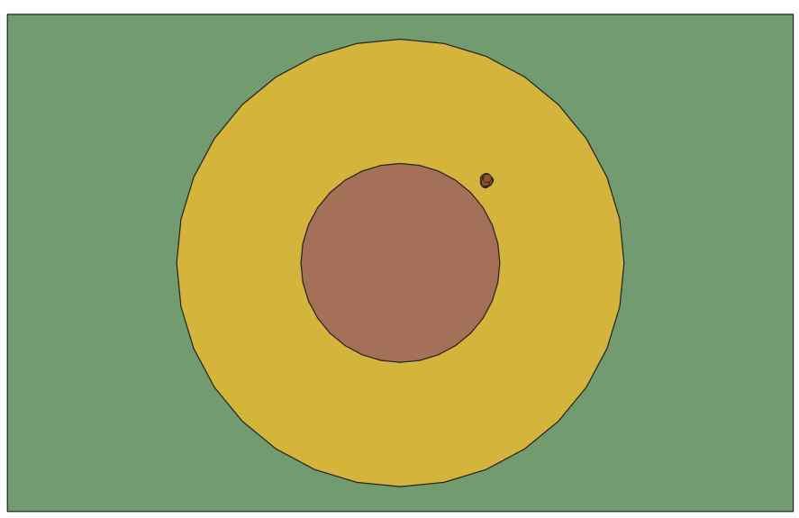

## P04.1 - Battle Ship (Part 1) A battleship simulation using spatial databases.
## Caleb Sneath
#### November 22, 2022

## Description: 
A fastAPI and psycopg2 based api for the simulation of battleships. This project is simply the first step, to read in
a JSON file of various assigned battleships and stats, read in the map, randomly place the battleships reasonably within
the map, and then export the positions as another JSON. In the future, more parts will be added.
The most notable technique here is the use of a "template" fleet. This allows for simple transformations such as 
movements and rotations of fleets by using the position and rotation normalized template fleet table.
This repository contains a collection of database backups, an api, documentation of query commands, and screenshots to show the results of loading spatial data from files, randomly determining positions, exporting the data, and visualizing that data. 

### Files

|   #   | File            | Description                                        |
| :---: | --------------- | -------------------------------------------------- |
|   1   | [spatialapi.py](https://github.com/CalebSneath/5443-Spatial-DB-Sneath/tree/main/Assignments/P04.1/spatialapi.py)         | Contains the main program file.  |
|   2   | [module/__init__.py](https://github.com/CalebSneath/5443-Spatial-DB-Sneath/tree/main/Assignments/P04.1/module/__init__.py)         | Contains any module import information. |
|   2   | [module/timeconversion.py](https://github.com/CalebSneath/5443-Spatial-DB-Sneath/tree/main/Assignments/P04.1/module/timeconversion.py)         | Contains general commands related to time conversions. |
|   3   | [Various .jpeg files]  | Screenshots to show end data visualization.  |
|   4   | [bbox.json](https://github.com/CalebSneath/5443-Spatial-DB-Sneath/tree/main/Assignments/P04.1/bbox.json) | Contains an example copy of the bounding box.  |
|   5   | [.config.json](https://github.com/CalebSneath/5443-Spatial-DB-Sneath/tree/main/Assignments/P04.1/.config.json) | Contains information to allow the api to interact with the server as well as form network connections.  |
|   6   | [ships.json](https://github.com/CalebSneath/5443-Spatial-DB-Sneath/tree/main/Assignments/P04.1/ships.json) | Contains an example copy of the input fleet information.  |
|   7   | [jsontest.json](https://github.com/CalebSneath/5443-Spatial-DB-Sneath/tree/main/Assignments/P04.1/jsontest.json) | Contains an example copy of the output fleet information.  |
|   8   | [backups/fleet.sql](https://github.com/CalebSneath/5443-Spatial-DB-Sneath/tree/main/Assignments/P04.1/fleet.sql) | Database backup of bbox table. |
|   9   | [backups/jsontest.sql](https://github.com/CalebSneath/5443-Spatial-DB-Sneath/tree/main/Assignments/P04.1/fleet_template.sql) | Database backup of bbox table. |
|   10  | [bbox.sql](https://github.com/CalebSneath/5443-Spatial-DB-Sneath/tree/main/Assignments/P04.1/bbox.sql) | Database backup of bbox table. |

### Local Instructions:
 Building: Requires Python (Tested for 3.9.5), FastAPI, and psycopg2. To install the last two, simply run in the terminal:
- pip install fastapi
- pip install psycopg2
 Afterward, set up your basic with pgAdmin and fill out the .config.json file. Adjust the line below to your install path if necessary for the confPath variable. 
 - Include the desired copy of ships.json and bbox.json for the input files in the local directory.
 - Run this file in the terminal with spatialapi.py and it should work.

### Server Instructions: 
 Get whatever server provider you choose. Follow the above instructions for local install. If pip install fails for psycopg2, try with the precompiled binaries instead by using:
   pip install psycopg2-binary
 For the ip address, ip probably needs to be set to "0.0.0.0" in config. Postgres and postgis may need to be installed also if they are not.

## Running Instructions:
 - After setting up with the above instructions, run "spatialapi.py".
 - Open up your web browser.
 - For all instructions below, {address} will be a placeholder for whatever ip and port you entered in the config file or for your server. For example, if you are running on a server with ip "167.999.99.99", and you selected port 8081, {address} would mean "167.999.99.99:8081". Likewise, if it was instead on localhost with port 8080, it would be "localhost:8081". Both of these are of course without the quotes.
 - For your first time running, in your address bar type and enter "http://{address}/createTables". This will create all tables for the first time in the database. This shouldn't need to be done again, unless you want to remove logged solutions.
 - Add whatever attacker's you need by typing into your address bar "http://{address}/addAttackerIP/{target address}" where {target address} follows a similar pattern as address, just for the attacker. Repeat this for any attackers.
 - (Optional) To permanently save an attacker ip so this does not need to be done again, in your address bar run "http://{address}/persistCurrentIPs"
 - To load up a new round of the simulation, run in your browser: "http://{address}/initializeSimulation". This will return the new ship positions.

### Overview
In order for a reasonable simulation to begin future projects, common methods of communication between servers needs to be established. This project furthers this goal by establishing common inputs and outputs to read fleets. It also helps initialize ship placement for the future.
 

 
This screenshot shows a QGIS visualization of the fleet template. The fleet is organized into staggered columns in as many columns specified by the api. The Each ship is placed center 222 meters apart from north to south, and 111 meters apart from east to west. This template then has some additional transformations done to it such as ST_Rotate and ST_Translate after finding a suitable random position in order to obtain the final placement on the map.
 

 
This screenshot shows a QGIS visualization of a random placement of ships in the database. The green rectangle shows the bounding box. The inner circle shows areas that were not supposed to allow ship placement since it was too close to the center. The outer circle shows areas that should be spawned in as long as they don't overlap with the inner circle so that the ships aren't too close to the outside edge. Not shown are lines between regions inside the bounding box as they were not permanently stored. Each region represents an angular area from the center points for sixteen cardinal directions, and boats should spawn entirely within a single region.

# Credits
### Example data obtained from: 
### https://github.com/rugbyprof/5443-Spatial-DB/tree/main/Assignments/P04.1
 
