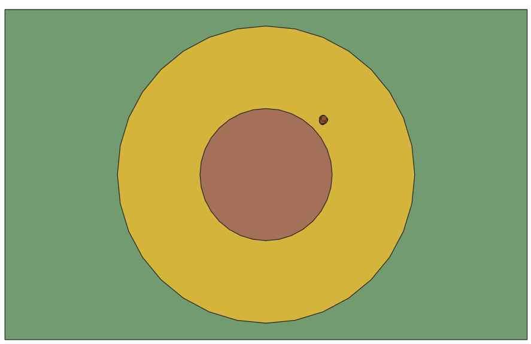

# P04.3 - Battle Ship (Part 3) - A Menu and Comms.
## Caleb Sneath
#### December 5, 2022

# Description: 
A fastAPI and psycopg2 based api for the simulation of battleships. This project is the third step, to create a way to broadcast and receive common messages, as well as to create a terminal based men for handling all clientside interaction with the game. 
 

### Example queries:
- fireGun: Takes a source ship, a selected gun, and target X/Y coordinates. Ensures that firing request is valid by examining available guns and ammo reserves. Then, then calculates the distance and angle of the target relative to the selected gun. Finally, gun angle is adjusted and ammo reserves are decreased according to fire rate, with some minor supplemental logic to ensure too many rounds aren't fired. Currently may have issues for some inputs which is being investigated.
- Various queries to adjust position as well as rotation, for both ships and the whole fleet: Takes a targeted fleet or ship respectively and a unit. Adjusts the current position or rotation by the inputted unit. In the case of ships being targeted, it creates a new fleet in the database composed entirely of that ship. Additionally, a singular gun on a ship can also be rotated in a similar manner, although this does not create a new fleet in the database.
- addEnemyPosition: Takes a position, a radius for in case the exact location is uncertain, and optionally an id for the fleet. Then these fields are added into a table in the database to track known enemy positions.
- A query to calculate whether a projectile hit a ship. Currently assumes linear projectile motion, but this may be adjusted later as necessary. Takes initial position and final target position. If this trajectory intercepts a ship, returns the earliest ship to intersect the interpolated trajectory. Otherwise, returns the distance of the closest ship to the target position.
- A query to calculate rudimentary damage given a ship and unit of energy as inputs. Then returns the ships damage, which currently may be zero. Damage formula may be adjusted in future. 
- A query to create a rectangular polygon given the position, length, width, and bearing for each ship in the database. Has two alternatives. One calculates the rectangular with the point corresponding to the bottom left corner of the rectangle, and an alternative which instead has the pont correspond to the center of the rectangle.

 
This is the final part for now, although it could serve as a good basis for expansion.
The most notable technique here is the use of a "template" fleet. This allows for simple transformations such as 
movements and rotations of fleets by using the position and rotation normalized template fleet table.
This repository contains a collection of database backups, an api, documentation of query commands, and screenshots to show the results of loading spatial data from files, randomly determining positions, exporting the data, and visualizing that data. 

### Files

|   #   | File            | Description                                        |
| :---: | --------------- | -------------------------------------------------- |
|   1   | [spatialapi.py](https://github.com/CalebSneath/5443-Spatial-DB-Sneath/tree/main/Assignments/P04.3/spatialapi.py)         | Contains the main program file.  |
|   2   | [module/__init__.py](https://github.com/CalebSneath/5443-Spatial-DB-Sneath/tree/main/Assignments/P04.3/module/__init__.py)         | Contains any module import information. |
|   2   | [module/timeconversion.py](https://github.com/CalebSneath/5443-Spatial-DB-Sneath/tree/main/Assignments/P04.3/module/timeconversion.py)         | Contains general commands related to time conversions. |
|   3   | [Various .jpeg files]  | Screenshots to show end data visualization.  |
|   4   | [bbox.json](https://github.com/CalebSneath/5443-Spatial-DB-Sneath/tree/main/Assignments/P04.3/bbox.json) | Contains an example copy of the bounding box.  |
|   5   | [.config.json](https://github.com/CalebSneath/5443-Spatial-DB-Sneath/tree/main/Assignments/P04.3/.config.json) | Contains information to allow the api to interact with the server as well as form network connections.  |
|   6   | [ships.json](https://github.com/CalebSneath/5443-Spatial-DB-Sneath/tree/main/Assignments/P04.3/ships.json) | Contains an example copy of the input fleet information.  |
|   7   | [Various SQL Files] | Assorted database backups. |
|   8   | [menu.py](https://github.com/CalebSneath/5443-Spatial-DB-Sneath/tree/main/Assignments/P04.3/menu.py) | Contains a Python file to run a menu to control the clientside part of the code.  |
|   9   | [comms.py](https://github.com/CalebSneath/5443-Spatial-DB-Sneath/tree/main/Assignments/P04.3/comms.py) | Contains a Python file with much of the code for base classes to send and receive messages.  |
|   10  | [listener.py](https://github.com/CalebSneath/5443-Spatial-DB-Sneath/tree/main/Assignments/P04.3/listener.py) | Contains a Python file to run a channel to intercept game related messages.  |
|   11  | [sender.py](https://github.com/CalebSneath/5443-Spatial-DB-Sneath/tree/main/Assignments/P04.3/sender.py) | Contains a Python file to implement a method to send messages on the game's comms channgels.  |
|   12  | [login.json](https://github.com/CalebSneath/5443-Spatial-DB-Sneath/tree/main/Assignments/P04.3/login.json) | Contains a JSON file with the clientside authentification credentials obtained from the game server.  |
|   13  | [tempRegion.json](https://github.com/CalebSneath/5443-Spatial-DB-Sneath/tree/main/Assignments/P04.3/tempRegion.json) | Contains a JSON file with the purpose of temporarily storing/logging game region info.  |
|   14  | [tempFleet.json](https://github.com/CalebSneath/5443-Spatial-DB-Sneath/tree/main/Assignments/P04.3/tempFleet.json) | Contains a JSON file with the purpose of temporarily storing/logging game fleet info.  |

### Local Instructions:
 Building: Requires Python (Tested for 3.9.5), FastAPI, and psycopg2. To install the last two, simply run in the terminal:
- pip install fastapi
- pip install psycopg2
- pip install pika
 Afterward, set up your basic with pgAdmin and fill out the .config.json file. Adjust the line below to your install path if necessary for the confPath variable. 
 - Include the desired copy of ships.json and bbox.json for the input files in the local directory.
 - Run this file in the terminal with spatialapi.py and it should work.

### Server Instructions: 
 Get whatever server provider you choose. Follow the above instructions for local install. If pip install fails for psycopg2, try with the precompiled binaries instead by using:
   pip install psycopg2-binary
 For the ip address, ip probably needs to be set to "0.0.0.0" in config. Postgres and postgis may need to be installed also if they are not.

## Running Instructions:
 - After setting up with the above instructions, run "spatialapi.py".
 - Open up your web browser.
 - For all instructions below, {address} will be a placeholder for whatever ip and port you entered in the config file or for your server. For example, if you are running on a server with ip "167.999.99.99", and you selected port 8081, {address} would mean "167.999.99.99:8081". Likewise, if it was instead on localhost with port 8080, it would be "localhost:8081". Both of these are of course without the quotes.
 - For your first time running, in your address bar type and enter "http://{address}/createTables". This will create all tables for the first time in the database. This shouldn't need to be done again, unless you want to remove logged solutions.
 - Add whatever attacker's you need by typing into your address bar "http://{address}/addAttackerIP/{target address}" where {target address} follows a similar pattern as address, just for the attacker. Repeat this for any attackers.
 - (Optional) To permanently save an attacker ip so this does not need to be done again, in your address bar run "http://{address}/persistCurrentIPs"
 - To load up a new round of the simulation, run in your browser: "http://{address}/initializeSimulation". This will return the new ship positions.
 - To start the client menu and listener, edit the login.json file, as well as any "creds" string in spatialapi.py, listener.py and sender.py with the appropriate credentials.
 - Launch spatialapi.py, then launch in separate terminals menu.py and listener.py

### Overview
This section of the project implements a firing command for ships that is broadcast, as well as a listener to intercept such messages. On top of that, a basic terminal menu was implemented to control the client side controls for managing fleets and ships.
 

 
This screenshot shows a QGIS visualization of the fleet template. The fleet is organized into staggered columns in as many columns specified by the api. The Each ship is placed center 222 meters apart from north to south, and 111 meters apart from east to west. This template then has some additional transformations done to it such as ST_Rotate and ST_Translate after finding a suitable random position in order to obtain the final placement on the map.
 

 
This screenshot shows a QGIS visualization of a random placement of ships in the database. The green rectangle shows the bounding box. The inner circle shows areas that were not supposed to allow ship placement since it was too close to the center. The outer circle shows areas that should be spawned in as long as they don't overlap with the inner circle so that the ships aren't too close to the outside edge. Not shown are lines between regions inside the bounding box as they were not permanently stored. Each region represents an angular area from the center points for sixteen cardinal directions, and boats should spawn entirely within a single region.

# Credits
### Menu code mostly obtained from:
### https://github.com/rugbyprof/5443-Spatial-DB/tree/main/Assignments/P04.3
### Example data obtained from: 
### https://github.com/rugbyprof/5443-Spatial-DB/tree/main/Assignments/P04.1
 
